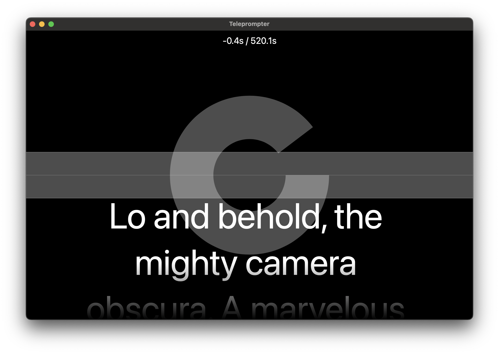

# Telepromter

A tiny teleprompter app written in SwiftUI with direct synchronization with Apple's Keynote.
Uses the moderator notes as script, and signals slide transitions using animations.
Used internally for my SIGGRAPH presentations 😉
